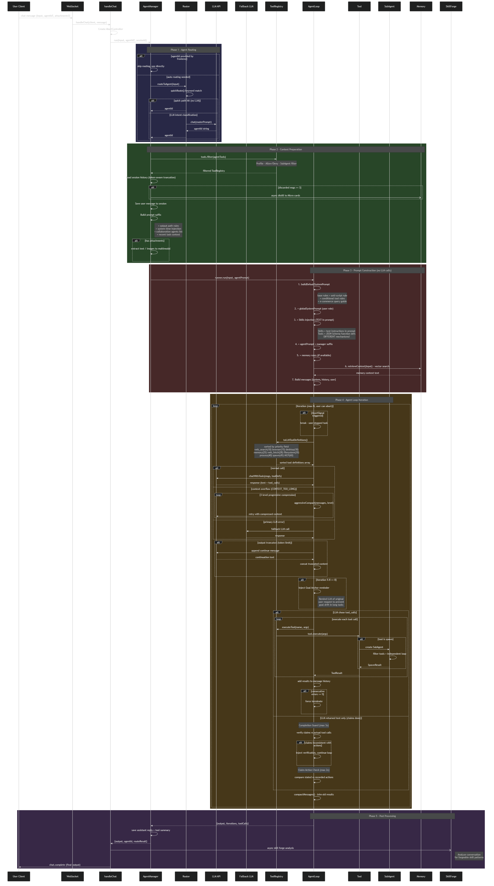

# Agent 请求处理全链路时序图

**创建时间：** 2026-04-18  
**最后更新：** 2026-04-18  
**作者：** 开发团队  
**状态：** 已发布  
**相关文档：**
- gateway/src/gateway/standalone.ts — WebSocket 入口
- gateway/src/agent/manager.ts — Agent 管理器
- gateway/src/agent/router.ts — 意图路由器
- gateway/src/agent/loop.ts — Agent Loop 核心循环
- gateway/src/agent/subagent.ts — SubAgent 执行器
- gateway/src/tools/registry.ts — 工具注册表
- gateway/src/tools/policy.ts — 工具策略过滤

## 文档概述

完整描述一个用户消息从 WebSocket 到达 Gateway 后，经过路由、上下文准备、Agent Loop 迭代、工具执行、到最终回复的全链路处理流程。包含所有内部机制（目标锚定、完成度校验、上下文压缩、技能注入、记忆蒸馏等）。

## 更新记录

| 日期 | 版本 | 更新内容 | 更新人 |
|------|------|----------|--------|
| 2026-04-18 | v1.0 | 初始版本 | 开发团队 |

---



<details>
<summary>📝 Mermaid 源码（点击展开，可用于在线编辑器重新渲染）</summary>

> 在线编辑器：https://mermaid.live  
> 本地渲染命令：`npx -y @mermaid-js/mermaid-cli -i agent_flow.mmd -o agent_flow.png -t dark -w 2400`

源文件：`agent_flow.mmd`（同目录）

</details>

## 2. 关键步骤速查表

| 步骤 | 文件 | 函数 | 调LLM? | 作用 |
|------|------|------|--------|------|
| ① 接收消息 | standalone.ts | `handleChat()` | ❌ | WebSocket 消息路由，创建 AbortController |
| ② Agent路由(快) | router.ts | `quickRoute()` | ❌ | 快速路径：关键词/长度/@匹配/单Agent |
| ②' Agent路由(慢) | router.ts | `routeToAgent()` | ✅ | LLM 意图分类（轻量 prompt） |
| ③ 工具过滤 | policy.ts | `resolveToolsForAgent()` | ❌ | 三层策略过滤（Profile→Allow/Deny→SubAgent） |
| ④ 会话历史加载 | manager.ts | `run()` | ❌ | Token-aware 截断，协作消息分离 |
| ④' 历史蒸馏 | manager.ts | `distillConversation()` | ❌ | 丢弃的旧消息 → 异步蒸馏为 Micro 卡片 |
| ⑤ 上下文注入 | manager.ts | `run()` | ❌ | 输出路径 + 时间 + 协作列表 + 最近任务 |
| ⑥ 附件预处理 | manager.ts | `buildEnrichedInput()` | ❌ | 文本提取 / 图片转 base64 多模态 |
| ⑦ 系统提示词 | loop.ts | `buildDefaultSystemPrompt()` | ❌ | 基础规则 + 条件工具规则，纯字符串拼接 |
| ⑦' 技能注入 | loop.ts | skills.filter → 拼接 | ❌ | 已启用技能的文本指令注入 prompt（≠工具定义） |
| ⑧ 记忆规则 | loop.ts | 条件拼接 | ❌ | memory_tool 可用时注入 save/search 指令 |
| ⑨ 记忆检索 | loop.ts | `retrieveContext()` | ❌ | 向量搜索相关记忆，拼入 prompt 尾部 |
| ⑩ 工具定义 | registry.ts | `toLLMToolDefinitions()` | ❌ | Tool→JSON Schema，注册顺序 = 发送顺序 |
| ⑪ LLM 调用 | loop.ts | `chatWithTools()` | ✅ | 核心调用：prompt(含Skill) + toolDefs(Tool) |
| ⑪' Fallback | loop.ts | fallbackLlm | ✅ | 主 LLM 失败时切备用 LLM |
| ⑫ 上下文压缩 | loop.ts | `aggressiveCompact()` | ✅ | CONTEXT_TOO_LONG → 3级渐进压缩后重试 |
| ⑬ 截断续写 | loop.ts | 截断检测 | ✅ | 输出被截断 → 追加"请继续"再次调用 |
| ⑭ 目标锚定 | loop.ts | Goal Anchor | ❌ | 每8步注入📌提醒，防止迷失目标 |
| ⑮ 工具执行 | registry.ts | `executeTool()` | ❌ | 执行 LLM 选中的工具 |
| ⑮' SubAgent | subagent.ts | `createSubAgentExecutor()` | ✅ | spawn 工具 → 嵌套 runAgentLoop |
| ⑯ 完成度校验 | loop.ts | Completion Guard | ❌ | 声称完成 vs 实际工具调用对比（最多3次） |
| ⑰ 一致性校验 | loop.ts | Claim-Action | ❌ | 声明的操作 vs 实际记录对比（最多2次） |
| ⑱ 消息压缩 | loop.ts | `compactMessages()` | ❌ | 每轮末尾压缩早期工具结果 + 合并锚定 |
| ⑲ 结果保存 | manager.ts | `addMessage()` | ❌ | 保存回复 + 工具调用摘要到会话 |
| ⑳ 技能锻造 | standalone.ts | `skillForge.analyze()` | ✅ | 异步分析可锻造技能（不阻塞回复） |

## 3. LLM API 调用汇总

整个链路中，以下节点会调用 LLM API：

| 节点 | 必定调用? | 说明 |
|------|-----------|------|
| Agent 路由(慢路径) | 仅多Agent+快速路径未命中 | 轻量 prompt，返回 agentId 字符串 |
| **chatWithTools** | **每次迭代必调** | 核心调用，携带全部 messages + toolDefs |
| Fallback LLM | 仅主LLM失败时 | 切备用模型重试 |
| 上下文压缩重试 | 仅上下文超限时 | 压缩后重新调用 chatWithTools |
| 截断续写 | 仅输出被截断时 | 追加"请继续"后再次调用 |
| SubAgent Loop | 仅 spawn 工具触发时 | 嵌套的独立 Agent Loop，有独立迭代 |
| Skill Forge | 任务完成后异步 | 分析对话模式，不阻塞用户回复 |

## 4. Skill vs Tool 传递机制对比

```
┌─────────────────────────────────────────────────────┐
│                   LLM API 调用                       │
│  chatWithTools(messages, toolDefinitions)            │
│                                                     │
│  messages[0] = system prompt                        │
│  ┌─────────────────────────────────────────┐        │
│  │ ## 基础规则 (buildDefaultSystemPrompt)   │        │
│  │ ## 条件工具规则 (browser/web_search...)  │        │
│  │ ## Installed Skills ◄── Skill 在这里     │        │
│  │   ### 技能A: 文本指令...                 │        │
│  │   ### 技能B: 文本指令...                 │        │
│  │ ## 记忆规则                              │        │
│  │ ## 记忆上下文                            │        │
│  │ ## Agent 系统提示                        │        │
│  │ ## 输出路径 + 时间 + 协作列表            │        │
│  └─────────────────────────────────────────┘        │
│                                                     │
│  toolDefinitions[] ◄── Tool 在这里                   │
│  ┌─────────────────────────────────────────┐        │
│  │ { name: "web_search", parameters: {...} }│        │
│  │ { name: "browser",    parameters: {...} }│        │
│  │ { name: "filesystem", parameters: {...} }│        │
│  │ { name: "process",    parameters: {...} }│        │
│  │ ...                                      │        │
│  └─────────────────────────────────────────┘        │
│                                                     │
│  LLM 读 prompt(含Skill指令) → 选择 Tool 执行         │
└─────────────────────────────────────────────────────┘
```

| 维度 | Skill（技能） | Tool（工具） |
|------|--------------|-------------|
| 传递方式 | 文本注入 system prompt | JSON Schema 作为 function definitions |
| LLM 感知 | 作为指令文本阅读 | 作为可调用函数列表 |
| 执行方式 | LLM 自行决定用哪些 Tool | LLM 返回 tool_calls → 代码执行 |
| 本质 | 知识/经验（"怎么做"） | 能力（"能做什么"） |
| 动态性 | 运行时可安装/卸载 | 启动时注册，运行时可过滤 |
| 来源 | SkillHub 安装 / Skill Forge 锻造 | 工厂函数注册 / MCP 动态注册 |

## 5. 工具优先级排序（已实施）

LLM 倾向选择工具列表中靠前的工具。通过给 Tool 接口增加 `priority` 字段，`toLLMToolDefinitions()` 按 priority 升序排列后再发给 LLM，引导 LLM 优先选择更合适的工具。

| priority | 工具 | 梯队 | 理由 |
|----------|------|------|------|
| 10 | `web_search` | 🔵 信息获取 | 搜索引擎，信息获取第一选择 |
| 15 | `browser` | 🔵 信息获取 | 网页交互、JS 渲染、可视化操作（核心能力） |
| 18 | `windows` / `desktop` | 🟢 系统交互 | 系统级操作、窗口管理（核心能力） |
| 25 | `memory_tool` | 🟢 系统交互 | 长期记忆存取 |
| 28 | `web_fetch` | 🟡 辅助工具 | URL 纯 HTTP 抓取（大量网站反爬/JS渲染拿不到，优先用 browser） |
| 30 | `filesystem` | 🟡 辅助工具 | 文件读写 |
| 40 | `process` | 🟠 代码执行 | 命令执行（应后选，避免写爬虫代替 web_search） |
| 45 | `spawn` | 🟠 代码执行 | 子任务委派 |
| 50 | `opencode` | 🟠 代码执行 | 代码编辑（默认值） |
| 55 | `office` | 🟡 辅助工具 | 文档处理 |
| 58 | `email` | 🟡 辅助工具 | 邮件发送 |
| 60 | MCP 工具 | ⚪ 外部扩展 | 外部扩展（mcp-client.ts 中统一设置） |
| 65 | `workflow` | ⚪ 自动化 | 工作流 |
| 70 | `scheduler` | ⚪ 自动化 | 定时任务 |

